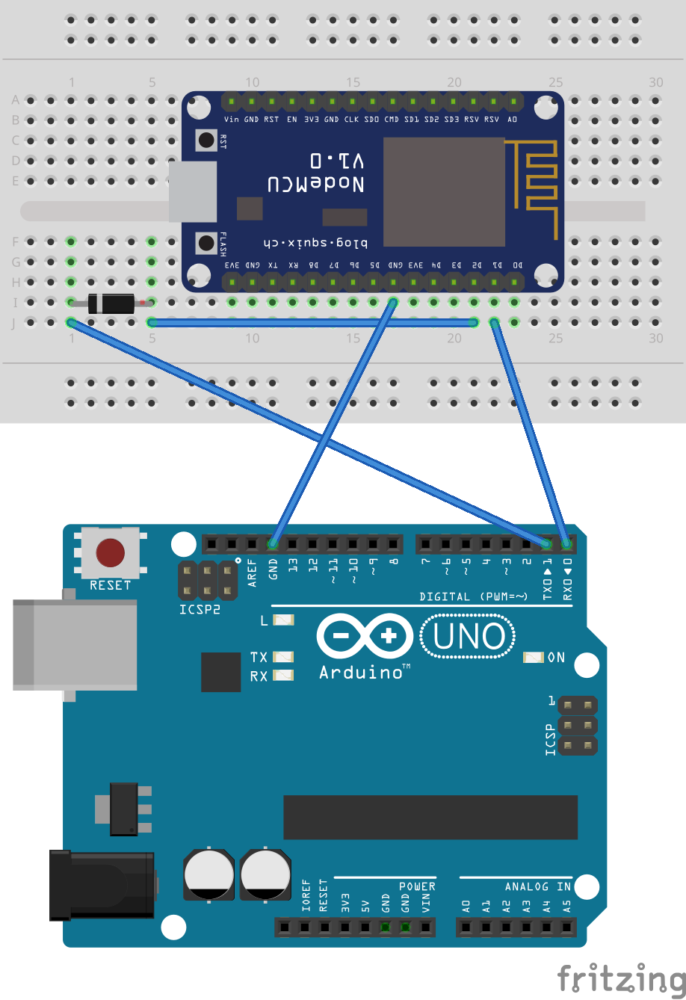

# SerialFi
## Introduction
SerialFi allows you to stream serial data from a micro-controller board to browser clients using any `ESP8266` based board. The firmware is developed and tested on a NodeMCU board but should work on any `ESP8266` based board with little or no modifications. The firmware also allows to send textual data back to the device from the wen interface, allowing two-way communication with the micro-controller board.

## Connection
The figure below shows a NodeMCU board with SerialFi firmware connected to an Arduino Uno. Since the Arduino is a 5v device, a Zener diode (1N4148) is used on the TX pin of the arduino for level shifting as the NodeMCU is only 3.3v tolerant. SerialFi uses the `SoftwareSerial` library on the pins below for serial communication.

| ESP8266 pin | GPIO # | Function |
|-------------|--------|----------|
| D1          | GPIO5  | TX       |
| D2          | GPIO4  | RX       |

## Usage
Upon startup, SerialFi tries to connect to the last used WiFi network. If it is unable to connect or this is the first boot, it creates a network called *SerialFiXXXX* where XXXX is a hex string based on the ESP8266 chip id. When connected to this SSID, it redirects to the WiFi setup page to facilitate the connection to the local WiFi network. Once connected to this local WiFi network, just visit the web app at http://ip.address.of.esp8266/. Here you can select the baud rate that the ESP8266 Software UART would connect with the micro-controller. If all gows well, you should start to see the serial data from the micro-controller in the web app.

The figure below shows the screenshot of the web interface of SerialFi.

 

## Arduino Shield
The `arduino` folder contains the Kicad design files for the SerialFi Arduino shield. This shield uses a Wemos D1 Mini or compatible ESP8266 dev board. It also has a small prototyping area with +5V, +3.3V and GND traces.

